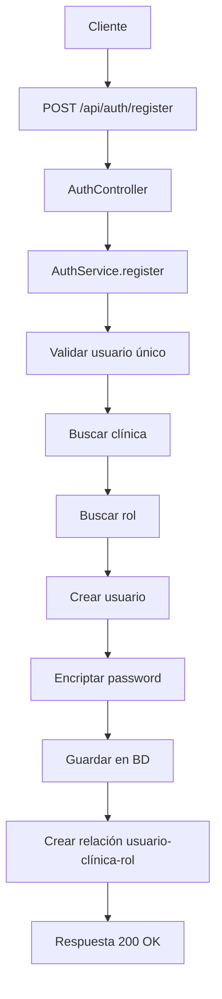
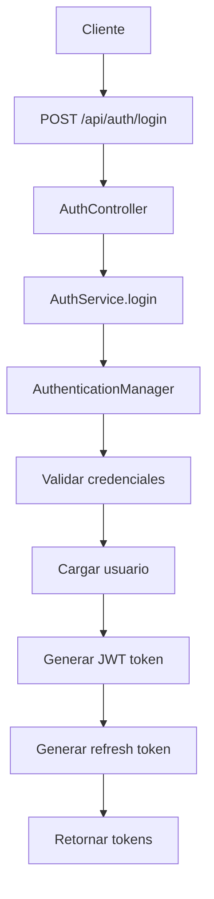

# 🔧 Documentación de Servicios - Auth Service

## 📋 Índice de Servicios

1. [AuthService](#authservice)
2. [JwtService](#jwtservice)
3. [UserService](#userservice)
4. [Repositorios](#repositorios)
5. [Configuración de Seguridad](#configuración-de-seguridad)

---

## 🔐 AuthService

### Descripción
Servicio principal que maneja el registro y autenticación de usuarios.

### Ubicación
```java
com.omi.auth.service.impl.AuthServiceImpl
```

### Dependencias
- `UserRepository`
- `ClinicRepository`
- `RoleRepository`
- `UserClinicRoleRepository`
- `PasswordEncoder`
- `JwtService`
- `AuthenticationManager`

### Métodos

#### `register(RegisterRequest request)`
**Propósito**: Registra un nuevo usuario en el sistema

**Parámetros**:
- `RegisterRequest request`: Datos del usuario a registrar

**Proceso**:
1. Valida que el username no exista
2. Busca la clínica por identifier
3. Busca el rol por nombre
4. Crea el usuario con password encriptado
5. Crea la relación usuario-clínica-rol

**Excepciones**:
- `IllegalArgumentException`: Si el usuario ya existe, clínica no encontrada, o rol no encontrado

**Ejemplo de uso**:
```java
@Autowired
private AuthService authService;

RegisterRequest request = new RegisterRequest();
request.setUsername("dr_garcia");
request.setEmail("garcia@clinica.com");
request.setPassword("password123");
request.setClinicIdentifier("clinica-norte");
request.setRoleName("MEDICO");

authService.register(request);
```

#### `login(LoginRequest request)`
**Propósito**: Autentica un usuario y genera tokens JWT

**Parámetros**:
- `LoginRequest request`: Credenciales de login

**Retorna**:
- `JwtAuthenticationResponse`: Contiene token y refreshToken

**Proceso**:
1. Autentica credenciales con AuthenticationManager
2. Busca el usuario por username
3. Genera token JWT
4. Genera refresh token
5. Retorna ambos tokens

**Excepciones**:
- `IllegalArgumentException`: Si las credenciales son inválidas

**Ejemplo de uso**:
```java
LoginRequest loginRequest = new LoginRequest();
loginRequest.setUsername("dr_garcia");
loginRequest.setPassword("password123");

JwtAuthenticationResponse response = authService.login(loginRequest);
String token = response.getToken();
String refreshToken = response.getRefreshToken();
```

---

## 🎫 JwtService

### Descripción
Servicio que maneja la generación, validación y extracción de información de tokens JWT.

### Ubicación
```java
com.omi.auth.service.impl.JwtServiceImpl
```

### Configuración
```java
@Value("${app.jwt.secret}")
private String jwtSecret;

@Value("${app.jwt.expiration}")
private long jwtExpiration;

@Value("${app.jwt.refresh-expiration}")
private long refreshExpiration;
```

### Métodos

#### `generateToken(UserDetails userDetails)`
**Propósito**: Genera un token JWT para el usuario

**Parámetros**:
- `UserDetails userDetails`: Información del usuario

**Retorna**:
- `String`: Token JWT

**Ejemplo de uso**:
```java
@Autowired
private JwtService jwtService;

User user = userRepository.findByUsername("dr_garcia").get();
String token = jwtService.generateToken(user);
```

#### `generateRefreshToken(Map<String, Object> extraClaims, UserDetails userDetails)`
**Propósito**: Genera un refresh token

**Parámetros**:
- `Map<String, Object> extraClaims`: Claims adicionales
- `UserDetails userDetails`: Información del usuario

**Retorna**:
- `String`: Refresh token

#### `extractUserName(String token)`
**Propósito**: Extrae el username del token JWT

**Parámetros**:
- `String token`: Token JWT

**Retorna**:
- `String`: Username del usuario

#### `isTokenValid(String token, UserDetails userDetails)`
**Propósito**: Valida si un token es válido para un usuario

**Parámetros**:
- `String token`: Token a validar
- `UserDetails userDetails`: Usuario a validar

**Retorna**:
- `boolean`: true si el token es válido

**Ejemplo de validación**:
```java
String token = "eyJhbGciOiJIUzI1NiIsInR5cCI6IkpXVCJ9...";
User user = userRepository.findByUsername("dr_garcia").get();

if (jwtService.isTokenValid(token, user)) {
    // Token válido, proceder
} else {
    // Token inválido, rechazar
}
```

---

## 👤 UserService

### Descripción
Servicio que proporciona funcionalidades relacionadas con usuarios para Spring Security.

### Ubicación
```java
com.omi.auth.service.impl.UserServiceImpl
```

### Dependencias
- `UserRepository`

### Métodos

#### `userDetailsService()`
**Propósito**: Proporciona un UserDetailsService para Spring Security

**Retorna**:
- `UserDetailsService`: Servicio para cargar usuarios

**Uso interno**: Este método es usado por Spring Security para cargar usuarios durante la autenticación.

---

## 🗄️ Repositorios

### UserRepository
```java
public interface UserRepository extends JpaRepository<User, UUID> {
    Optional<User> findByUsername(String username);
    Optional<User> findByEmail(String email);
}
```

**Métodos personalizados**:
- `findByUsername(String username)`: Busca usuario por nombre de usuario
- `findByEmail(String email)`: Busca usuario por email

### ClinicRepository
```java
public interface ClinicRepository extends JpaRepository<Clinic, UUID> {
    Optional<Clinic> findByIdentifier(String identifier);
}
```

**Métodos personalizados**:
- `findByIdentifier(String identifier)`: Busca clínica por identificador único

### RoleRepository
```java
public interface RoleRepository extends JpaRepository<Role, Long> {
    Optional<Role> findByName(String name);
}
```

**Métodos personalizados**:
- `findByName(String name)`: Busca rol por nombre

### UserClinicRoleRepository
```java
public interface UserClinicRoleRepository extends JpaRepository<UserClinicRole, Long> {
}
```

**Uso**: Maneja las relaciones entre usuarios, clínicas y roles.

---

## 🔒 Configuración de Seguridad

### SecurityConfiguration
**Ubicación**: `com.omi.auth.config.SecurityConfiguration`

#### Configuración de Endpoints
```java
// Endpoints públicos (no requieren autenticación)
"/api/auth/register"
"/api/auth/login"

// Endpoints protegidos (requieren autenticación)
Todos los demás endpoints
```

#### Filtros de Seguridad
1. **JwtAuthenticationFilter**: Valida tokens JWT en cada request
2. **AuthenticationProvider**: Maneja la autenticación con base de datos
3. **PasswordEncoder**: BCrypt para encriptar passwords

### JwtAuthenticationFilter
**Ubicación**: `com.omi.auth.config.JwtAuthenticationFilter`

**Proceso**:
1. Extrae token del header Authorization
2. Valida formato del token
3. Extrae username del token
4. Carga usuario de la base de datos
5. Valida token contra usuario
6. Establece autenticación en SecurityContext

---

## 🔧 Configuración de Beans

### AuthServiceApplication
```java
@Bean
public PasswordEncoder passwordEncoder() {
    return new BCryptPasswordEncoder();
}

@Bean
public AuthenticationManager authenticationManager(
    AuthenticationConfiguration config) throws Exception {
    return config.getAuthenticationManager();
}

@Bean
public AuthenticationProvider authenticationProvider() {
    DaoAuthenticationProvider authProvider = new DaoAuthenticationProvider();
    authProvider.setUserDetailsService(userService.userDetailsService());
    authProvider.setPasswordEncoder(passwordEncoder());
    return authProvider;
}
```

---

## 📊 Flujo de Datos

### Registro de Usuario


### Login de Usuario


---

## 🧪 Testing de Servicios

### Ejemplo de Test de AuthService
```java
@Test
void shouldRegisterUserSuccessfully() {
    // Given
    RegisterRequest request = new RegisterRequest();
    request.setUsername("test_user");
    request.setEmail("test@example.com");
    request.setPassword("password");
    request.setClinicIdentifier("test-clinic");
    request.setRoleName("MEDICO");
    
    // When
    authService.register(request);
    
    // Then
    Optional<User> user = userRepository.findByUsername("test_user");
    assertTrue(user.isPresent());
    assertEquals("test@example.com", user.get().getEmail());
}
```

### Ejemplo de Test de JwtService
```java
@Test
void shouldGenerateValidToken() {
    // Given
    User user = createTestUser();
    
    // When
    String token = jwtService.generateToken(user);
    
    // Then
    assertNotNull(token);
    assertTrue(jwtService.isTokenValid(token, user));
    assertEquals("test_user", jwtService.extractUserName(token));
}
```

---

## 🚨 Manejo de Errores

### Excepciones Comunes
- `IllegalArgumentException`: Datos inválidos o no encontrados
- `UsernameNotFoundException`: Usuario no encontrado
- `BadCredentialsException`: Credenciales incorrectas
- `JwtException`: Token JWT inválido o expirado

### Logging
Los servicios utilizan logging para registrar:
- Intentos de registro exitosos/fallidos
- Intentos de login exitosos/fallidos
- Generación de tokens
- Errores de validación

---

## 📈 Métricas y Monitoreo

### Métricas Disponibles
- Número de registros por minuto
- Número de logins por minuto
- Tokens generados por minuto
- Errores de autenticación por minuto

### Health Checks
- Conexión a base de datos
- Validez de configuración JWT
- Estado de repositorios

---

Esta documentación proporciona una guía completa para entender y utilizar todos los servicios del microservicio auth-service. Para más detalles específicos, consultar el código fuente en cada clase mencionada.
