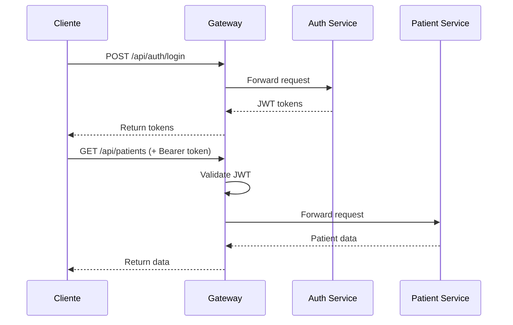

# API Gateway - Especificación

## 🌐 Información General

**Base URL**: `https://api.omi-health.com`  
**Versión**: v1  
**Protocolo**: HTTPS  
**Formato**: JSON  

## 🔐 Autenticación

Todos los endpoints (excepto `/auth/login` y `/auth/register`) requieren autenticación mediante JWT Bearer Token.

```http
Authorization: Bearer <access_token>
```

## 📋 Estructura de Respuestas

### Respuesta Exitosa

```json
{
  "success": true,
  "data": { ... },
  "message": "Operación exitosa",
  "timestamp": "2024-01-15T10:30:00Z"
}
```

### Respuesta de Error

```json
{
  "success": false,
  "error": {
    "code": "VALIDATION_ERROR",
    "message": "Los datos proporcionados no son válidos",
    "details": [
      {
        "field": "email",
        "message": "El email no es válido"
      }
    ]
  },
  "timestamp": "2024-01-15T10:30:00Z"
}
```

## 🔀 Rutas del Gateway

### Autenticación
- `POST /api/auth/**` → Auth Service (Port 8081)

### Pacientes
- `GET|POST|PUT|DELETE /api/patients/**` → Patient Service (Port 8082)

### Citas
- `GET|POST|PUT|DELETE /api/appointments/**` → Appointment Service (Port 8083)

### Notificaciones
- `GET|POST|PUT|DELETE /api/notifications/**` → Notification Service (Port 8084)

### Informes
- `GET|POST /api/reports/**` → Report Service (Port 8085)

### Pagos
- `GET|POST /api/payments/**` → Payment Service (Port 8086)

### Media
- `GET|POST|DELETE /api/media/**` → Media Service (Port 8087)

### Analytics
- `GET /api/analytics/**` → Analytics Service (Port 8088)

## 🛡️ Seguridad

### Rate Limiting

```yaml
Rate Limits:
  - Autenticación: 5 requests/minuto
  - APIs generales: 100 requests/minuto
  - Upload de archivos: 10 requests/minuto
```

### CORS

```yaml
Allowed Origins:
  - https://app.omi-health.com
  - https://portal.omi-health.com
  - tauri://localhost (para app desktop)

Allowed Methods:
  - GET, POST, PUT, DELETE, OPTIONS

Allowed Headers:
  - Authorization, Content-Type, X-Request-ID
```

## 📊 Códigos de Estado HTTP

| Código | Significado |
|--------|-------------|
| 200 | OK - Solicitud exitosa |
| 201 | Created - Recurso creado exitosamente |
| 204 | No Content - Solicitud exitosa sin contenido |
| 400 | Bad Request - Datos inválidos |
| 401 | Unauthorized - No autenticado |
| 403 | Forbidden - No autorizado |
| 404 | Not Found - Recurso no encontrado |
| 409 | Conflict - Conflicto (ej. email duplicado) |
| 422 | Unprocessable Entity - Validación fallida |
| 429 | Too Many Requests - Rate limit excedido |
| 500 | Internal Server Error - Error del servidor |
| 503 | Service Unavailable - Servicio no disponible |

## 🔍 Filtrado, Ordenamiento y Paginación

### Paginación

```http
GET /api/patients?page=1&size=20
```

**Respuesta**:
```json
{
  "success": true,
  "data": {
    "content": [...],
    "page": 1,
    "size": 20,
    "totalElements": 150,
    "totalPages": 8,
    "first": false,
    "last": false
  }
}
```

### Ordenamiento

```http
GET /api/patients?sort=lastName,asc&sort=firstName,asc
```

### Filtrado

```http
GET /api/patients?riskLevel=RED&planType=HIM
```

### Búsqueda

```http
GET /api/patients?search=Juan
```

## 🔧 Headers Personalizados

### Request Headers

- `X-Request-ID`: UUID único para tracing
- `X-Clinic-ID`: ID de la clínica (para multi-tenancy)
- `Accept-Language`: Idioma preferido (es, en)

### Response Headers

- `X-Request-ID`: Echo del request ID
- `X-RateLimit-Remaining`: Requests restantes
- `X-RateLimit-Reset`: Timestamp de reset del rate limit

## 📝 Versionado de API

La versión se incluye en la URL:

```
/api/v1/patients
/api/v2/patients (futura versión)
```

## 🚨 Manejo de Errores

### Códigos de Error Comunes

| Código | Descripción |
|--------|-------------|
| `AUTH_001` | Token inválido o expirado |
| `AUTH_002` | Credenciales incorrectas |
| `AUTH_003` | Cuenta bloqueada |
| `VAL_001` | Validación de datos fallida |
| `RES_001` | Recurso no encontrado |
| `RES_002` | Recurso duplicado |
| `PERM_001` | Permisos insuficientes |
| `SYS_001` | Error interno del servidor |
| `SYS_002` | Servicio no disponible |

## 📊 Métricas y Monitoreo

El Gateway expone métricas en:

```
GET /actuator/metrics
GET /actuator/health
GET /actuator/info
```

## 🔐 Ejemplo de Flujo de Autenticación


